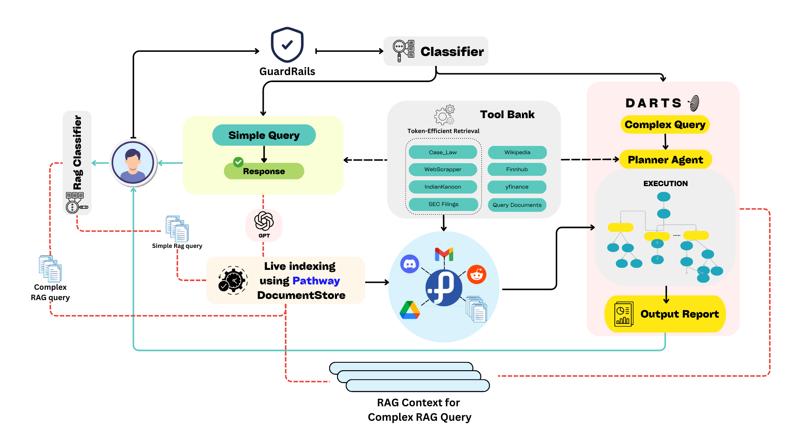
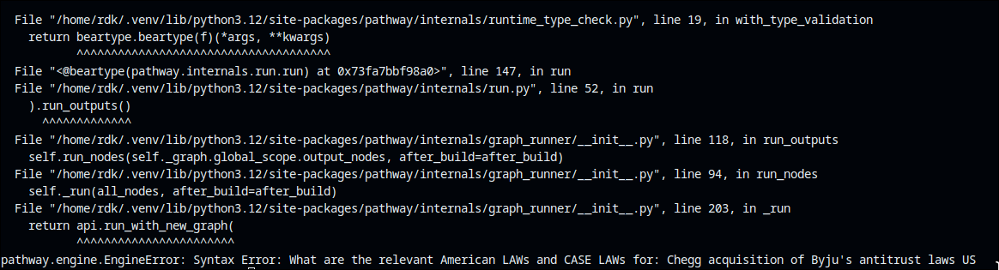

# DARTS : Dynamic Agentic Reflective Tree Search
Submission Repository of team_30 for Pathway High prep PS for Inter IIT Tech Meet 13.0 . The PS involved implementing a Dynamic Agentic RAG system using Pathway's unique realtime ETL pipeline.

## DARTS architecture


## Instructions to set up
The repo has 5 directores:  
```
├── app
├── pipeline
└── pathway_rag
└── Dataset
└── Evaluation
└── sample_responses
```
Fill in the empty api keys in `.env.example` and make it `.env` by the following command
```bash
mv .env.example .env
```
### Run using Docker

#### Build the Services
```bash
sudo docker-compose build
```
Start the Services
```
sudo docker-compose up -d
```
It would start the following Containers:
* app
* pipeline
* rag

To Start a shell in a Docker Container, execute the following command
```bash=
sudo docker exec -it id/name_of_the_container /bin/bash
```
Now run the following files in **rag** container
```bash=
cd ~/pathway_rag && python3 http_serve.py
cd ~/pathway_rag && python3 pw_new.py
cd ~/pathway_rag && python3 pw_userkb.py
cd ~/pathway_rag && python3 rag_server.py
```
Now run the following files in **pipeline** container
```bash=
cd ~/pipeline && python3 change.py
cd ~/pipeline && python3 main.py
```
Now do the following files in **app** container
```bash=
cd ~/app && python3 app.py
cd ~/app && npm i && npm run dev
```
To Stop and Remove the Docker Containers
```bash=
sudo docker-compose down
```
### Run without docker
Setup a new environment with python version 3.12, if not using Docker it is recommended to make two different virtual environments for `pathway_rag` & `pipeline` as they have some clashing dependencies, then install the required dependencies:

```bash
 cd pathway_rag && pip install -r requirements.txt
 cd app && pip install -r requirements.txt
 cd pipeline && pip install -r requirements.txt
```

### Installation of other dependencies and other remarks
For parsing as we are using Pathway's ``ParseUnstrucutured`` from ``pw.xpacks.llms.parsers`` which internally uses the Unstructured.io opensource library which needs tesseract-ocr installed at OS level : 

In Ubuntu and other such linux distributions , 

It can be installed using  the following : 

```
sudo apt-get install tesseract-ocr
```
in other OS's the same can be installed using the package manager of your choice.

After installation go to `/pathway_rag` and `pw_new.py` and `pw_userkb.py` and modify the ``os.environ(TESSDATA_PREFIX)`` under the ``DocumentProcessor`` class to the path of the ``tessdata`` directory which is typically found in the ``/usr/share/tesseract-ocr/4.00`` directory but might change depending on your environment or OS.

Depending on the OS/Environment an error related to poppler utils could arise which can be resolved by installing the following: 
For Ubuntu/similiar: 
```
sudo apt-get install poppler-utils
```

### Specifically for MacOS 

Libmagic is required as a dependancy which can be installed using the following 

```
brew install libmagic
```
### Other Remarks 

> All of these scripts (.py)  need to be started in separate terminal sessions.

> It is recommended to clear memory buffer otherwise answers may include references to the previous chats. 

## Instructions for running the pipeline using the Dockerfile


## Services Overview

### 1. **pathway_rag**
- **Ports**:
  - `8000`: `http_server.py`
  - `4004`: `pw_new.py`
  - `4005`: `rag_server.py`
  - `4006`: `pw_userkb.py`
- **Dockerfile**: `pathway_rag.dockerfile`

### 2. **app**
- **Ports**:
  - `5173`: React Frontend
  - `5001`: Flask Backend
- **Dockerfile**: `app.dockerfile`

### 3. **pipeline**
- **Ports**:
  - `8080`: `main.py`
  - `8090`: `change.py`
- **Dockerfile**: `pipeline.dockerfile`

---


## pathway_rag
This directory contains files pertaining to the RAG Pipeline.

This directory has the following files  : 
```
├── http_serve.py
├── pw_new.py
├── pw_userkb.py
├── rag_server.py
├── requirements.txt
├── team-30-441514-d9a9da2d500c.json
```

**To run these scripts associated with the RAG pipeline please ensure that the port 4004 , 4005 , 4006 and 8000 are all free and currently not being used by any other services**. 

### http_serve.py
Running this script exposes a file upload server at http://localhost:8000 with an upload endpoint at `/uploads` which uploads a file at directory named uploads with the following path `/pathway_rag/uploads` .
```
python3 http_serve.py
```
### pw_new.py & pw_userkb.py
Running this script exposes a pathway `DocumentStoreServer` instance at http://localhost:4004 which has 3 endpoints `v1/retrieve` , `v1/inputs` and `v1/statistics` . 
```
python3 pw_new.py
```
This instance monitors and indexes files coming in a directory named `temp_rag_space` which is automatically created if not available.

Similiarly running
```
python3 pw_userkb.py
```
starts a `DocumentStoreServer` instance at http://localhost:4006 which monitors and indexes file changes in the `uploads` directory inside the `pathway-rag` directory.

### rag_server.py

Running this script exposes a FAST Api and gunicorn based rag query processing instance at http://localhost:4005 which only has a single endpoint `/generate`
```
python3 rag_server.py
```


<!--
### User Interface

We have built a React + Vite web app to simulate the functionality of DARTS. Using Websocket fucntionality we 
seamlessly enable real-time communication between the front end and back end.  This allows the user to dynamically send queries to the server and receive logs and other data without delay. 

This directory has the following main components:
```
├── Main
├── Sidebar
└── Graphbar
```
-->


## app

This directory contains all the code for the front end of our React based web app along with server side code for rendering and parsing.

You are required to run the following to run the UI on your browser : 
```
npm i 
npm run dev
```
This will display the UI which can be accessible on http://localhost:5173.

Apart from this some helper code to aid in post-processing of the final response `app.py` has to be run.

`app.py` can be run by the following commands:
```
pip install -r requirements.txt
python3 app.py
```

The flask backend will listen on http://localhost:5001 for the response data, and allow users to convert it into pdf and download it. It will also enable in using the Data Visualisation feature to make plots based on the query.

## pipeline

This directory contains the main agentic pipeline of our entire solution . 

Here, the following files need to be run to finally start our pipeline.

```
python3 main.py 
```
This starts the websocket connections along with the DARTS pipeline.
```
python3 change.py
```
**Please note that for complete functioning of the pipeline the ports ``8080`` and ``8090`` need to be free.**
This provides support for verbosity to be able to visualize the thinking process throughout execution.


## Dataset 

This folder contains three datasets to evaluate our pathway-enabled RAG framework: a 323-pair MnA QA dataset for general queries, a 501-pair role-specific dataset (financial and legal) with single-hop and multi-hop splits, and a 306-question exhaustive dataset from Microsoft's Activision acquisition report for testing diverse query handling.


## Eval 

In this evaluation methodology, we are implementing multi-agentic framework where we have expert reviewer agent to review and compare the responses, judge agent which passes the judgment based on the reviews and then we have grade agent to grader the scores based on pre-defined metric rubric.

## sample_responses 

This folder consists of sample reports generated using DARTS on an assortment of different queries. 


## Possible bug in Document Store 

While extensively testing pathway's various features while solving this PS we discovered a rare but unique error which is displayed below .
  

Upon further investigation it became apparent that the error was caused due to unsanitizied input to the ``DocumentStore`` by the ``retreive_query`` function under the ``DocumentStore`` class in ``document_store.py`` . Specifically over here  : 
```python
        retrieval_results = retrieval_queries + self._retriever.query_as_of_now(
            retrieval_queries.query # unsanitized user input directly passed for retrieval,
            number_of_matches=retrieval_queries.k,
            metadata_filter=retrieval_queries.metadata_filter,
        ).select(
            result=pw.coalesce(pw.right.text, ()),
            metadata=pw.coalesce(pw.right.metadata, ()),
            score=pw.coalesce(pw.right[_SCORE], ()),
        )
```

### Fix for this error 

An possible an easy fix for this bug is to simply sanitize the query using ``urllib.parse`` as shown below before sending it for retreival 

```python  
       @pw.udf
        def sanitize_query(query: str) -> str:
            if not query or not query.strip():
                return ""
            # URL encode the query to escape special characters
            return urllib.parse.quote(query.strip(), safe='')
        sanitized_queries = retrieval_queries.select(
            query=sanitize_query(pw.this.query),
            k=pw.this.k,
            metadata_filter=pw.this.metadata_filter,
            filepath_globpattern=pw.this.filepath_globpattern
        )
        
        retrieval_queries = self.merge_filters(sanitized_queries)
```