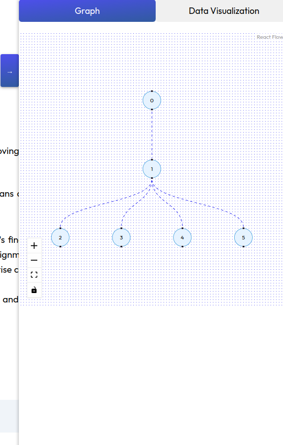

### USER INTERFACE
---
This directory contains the code for our User Interface utilizing the React framework alongside Websockets and a server side flask app for rendering and parsing. It allows us to try out our custom queries, generating interactive tree like graphs outlining our our dynamic multi agentic approach.


Following is the tree structure of the UI:
```
app
├── src
│   ├── assets
│   ├── components
        ├── main
        ├── sidebar
        ├── graphbar
        ├── file
        ├── dropdown
│   ├── context
│   ├── app.py

```

1. **``assets``**:  This folder contains the all the images used throughout the website.
2. **``components``**: 
    - This folder contains all the individual components of our web app.
    - Main - The main component of our website where the chat interface is present. It contains a search box to interact with the bot as well as upload files to our RAG, both from the computer and to a Google Drive.  It also contains options for the user to select the version of the LLM they wish to use and whether they want to search on their own.
    - Sidebar - The sidebar component stores the previous chats with the user and even allows the user to create new chats. It also has options for users to initialise their credentials. It also contains the file system viewer to have a look at the files uploaded till now.

    - Graphbar - This component demonstrates our Multi Agentic approach. Depending on the query, a multi level graph is generated. On hovering over the nodes, we receive the metadata of that particular agent, including it's Role description and the tools it uses. We also have a data visaulization section which plots the Candlestick and Time series patterns of the 2 companies depending on the query, the data for which is obtained from the Flask backend.  

    - File - Helper component to view the file history of the uploaded files.
    - Dropdown - Helper component to make a dropdown and allow users to choose their desired LLM to process the query.

3. **``Context``**:
    - This serves as a centralized store for managing shared state across components, providing a single source of truth for variables and state data used throughout the application. It enhances code maintainability, simplifying state updates, and promoting scalability by allowing easy integration of new features. It is particularly useful for managing global data.

3. **``app.py``**:
    - This serves as our flask backend for rendering images and plots and parsing content. It helps out in the data visualization component by extracting the data of the companies and sending it to the front end. It also finds use in downloading the Markdown response of the user.

 
 


